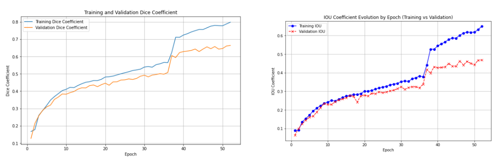
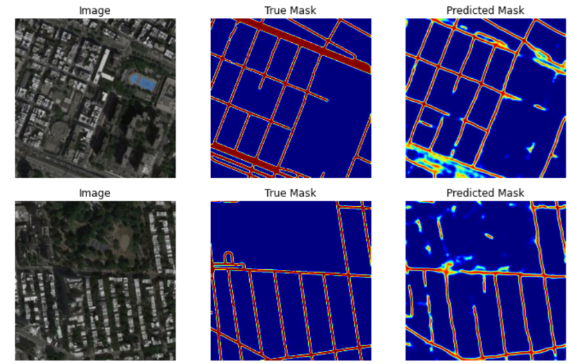
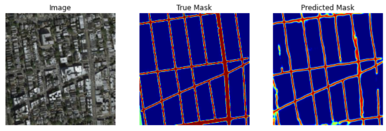

# Computer Vision Project

# imgToMap: Satellite Images Segmentation with UNet - Jupyter Notebook

This project demonstrates image segmentation using a **UNet** convolutional neural network, implemented in a Jupyter notebook. The model is designed to segment satellite images to generate road maps, similar to Google Maps.

## Project Overview

The goal of this project is to build a UNet model capable of segmenting satellite images, identifying roads and structures with high precision. The notebook walks through data preprocessing, model creation, training, and evaluation.

## Dataset

The project uses a custom dataset available on Kaggle:
- [Satellite Google Maps Dataset](https://www.kaggle.com/datasets/arka47/satellitegooglemapsmasks)

## Notebook Features

- **Model Architecture:** Implementation of the UNet architecture for image segmentation.
- **Custom Metrics:** Uses Dice coefficient and IoU (Intersection over Union) as evaluation metrics.
- **Loss Function:** Custom loss function based on Dice coefficient.
- **Visualization:** The notebook includes visualizations of model predictions vs. actual segmentation masks.

## Requirements

To run this notebook, the following dependencies are needed:

```bash
pip install numpy tensorflow keras opencv-python scikit-learn matplotlib
```

## Running the Notebook

1. Download or clone the repository.
2. Open the notebook (`segmentation_unet.ipynb`) in Jupyter or Google Colab.
3. Ensure you have access to the dataset (mounted via Google Drive if using Colab).
4. Run each cell to load data, build the model, train, and visualize the results.

## Model Training

- Model weights are saved using model checkpointing, ensuring the best model is retained based on validation loss.

## Evaluation

The model is evaluated using:
- **Dice Coefficient**
- **IoU (Intersection over Union)**

## Results

The model successfully segments roads and other key structures with strong performance across evaluation metrics. Below are the key results:

### IOU and Dice Curves:



### Sample Results:




## License

This project is licensed under the MIT License - see the [LICENSE](LICENSE) file for details.


